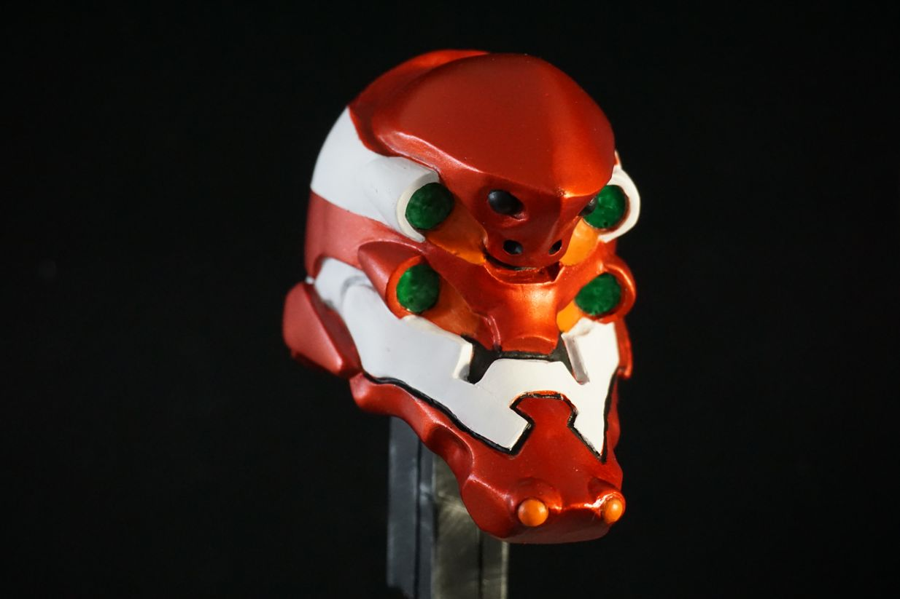

This was sculpted in an oil based clay and then molded and casted in resin.

To paint this sculpt I sprayed a base coat of silver paint and then masked and airbrushed the red sections. 

I really struggled in painting this one, I used Tamiya red transparent which has a weird consistency, it is a bit more thicker and sticky than the other paints, so what I learned from this is to add just a bit of water to the paint, only about 2 or 3 drops, and also spray small amounts of paint at a time because this paint dries even faster and it clogs the airbrush pretty fast. 

Another thing I learned with this type of paint is that when you finish the paint that is in the cup, clean the airbrush by spraying just water or alcohol, that way it will be clean to receive the next amount of paint, and it won’t get clogged. 

The rest of the colors I just hand painted them.

