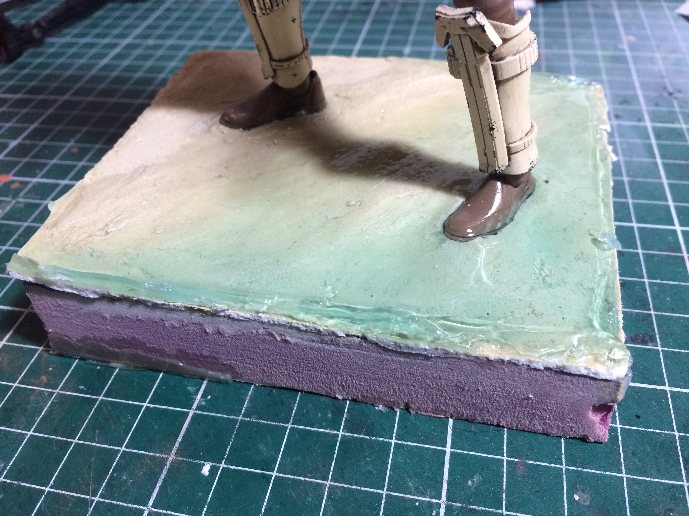

Working on a beach base for a bandai shore trooper figure wanted to try out vallejo water fx to simulate the water going up the shore. I’d previously  seen tutorials on how to make water scenes however didn’t look specifically a tutorial with that specific product, the kind of tutorials i found were using a two part resin. I came to find out that using vallejo water fx is different and I think for particular situations. 

I read the instructions on the bottle, which they state to pour the material in layers no more than 3mm and let it dry for about 24hrs. 

So For that project I created styrene walls and filled the gaps between the styrene and the base with some specling paste which I used to simulate the sand, thought that would be enough to prevent the liquid from leacking, I was wrong, that stuff is really runny and because its cure time is so long it has a lot of time to flow through any tiny gap it founds, So next time I will make sure to seal everything with hot glue.

Now for the amount of resin, make sure you are pouring exactly no more than those 3mm if you pour a bit more it will take double the time to cure, I even had to remove the styrene walls to let air go through and let it cure.

The last thing, this material doesn’t cure like normal resin, it is not rock hard, it feels like a rubbery type material so it’s a bit different to cut. 

What I’ve learned using this product is that maybe this would work best with situations where want to represent tiny ammounts of water like puddles, and also if you want to make running water like waterfalls, since you can put tiny amounts of the product on a flat surface where it wont stick like a glass and then when it dryies you can peel of the material and glue it in the shape of falling water. 

