For this x-mas I wanted to give to my siblings something they really like, so I decided to make this coasters of their favorite show.

I first made a master coaster by cutting out the basic shapes out of sintra, then with a sculpting tool I engraved the wood texture glued the pieces together, and added little punched styrene circles to simulate rivets of some kind, then primed and sanded the piece. Made a one part silicone mold and casted a bunch of them, wanted to make 2 sets of 4, after that I prepared them for painting.

For the Stencils with the crests I cut out the shpes out of cardboard paper, this wasn’t perfect so I had to fix some details by hand after I painted the basic shape with the stencil.

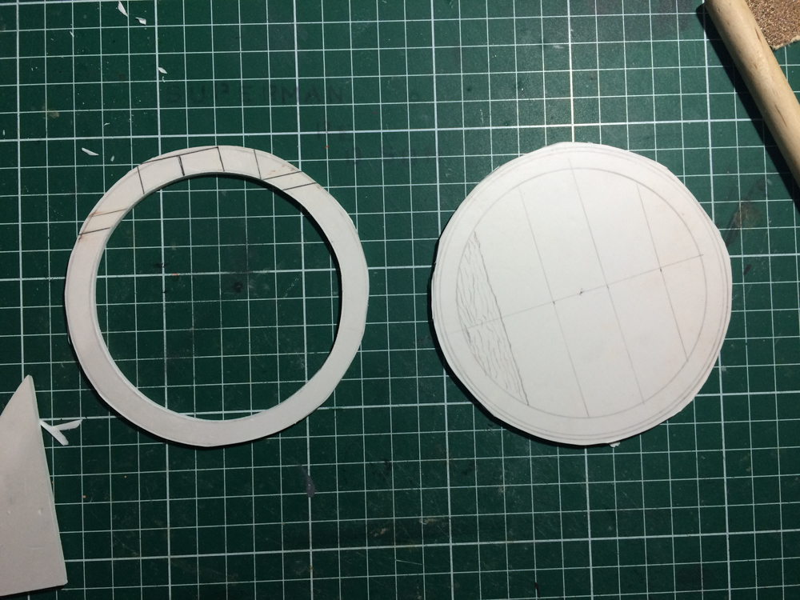

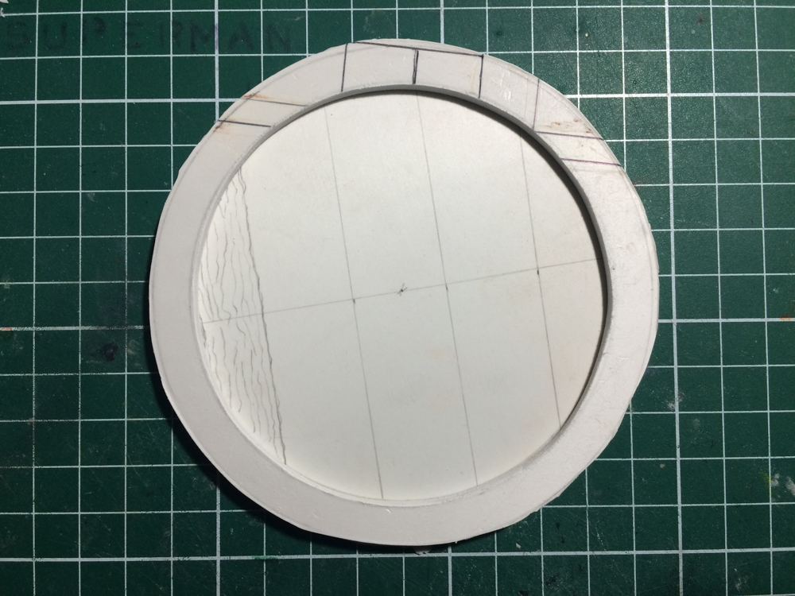

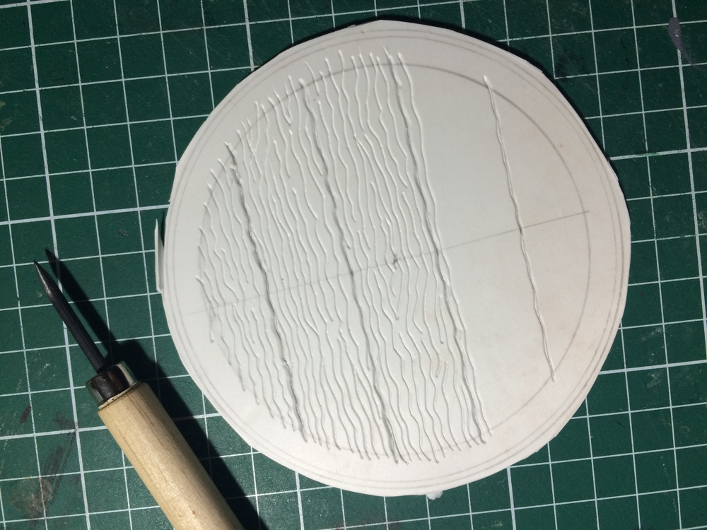

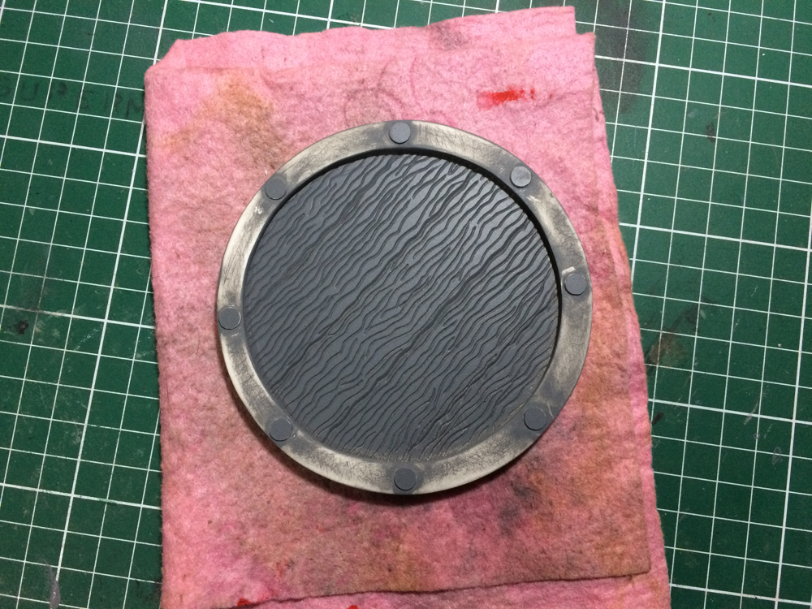

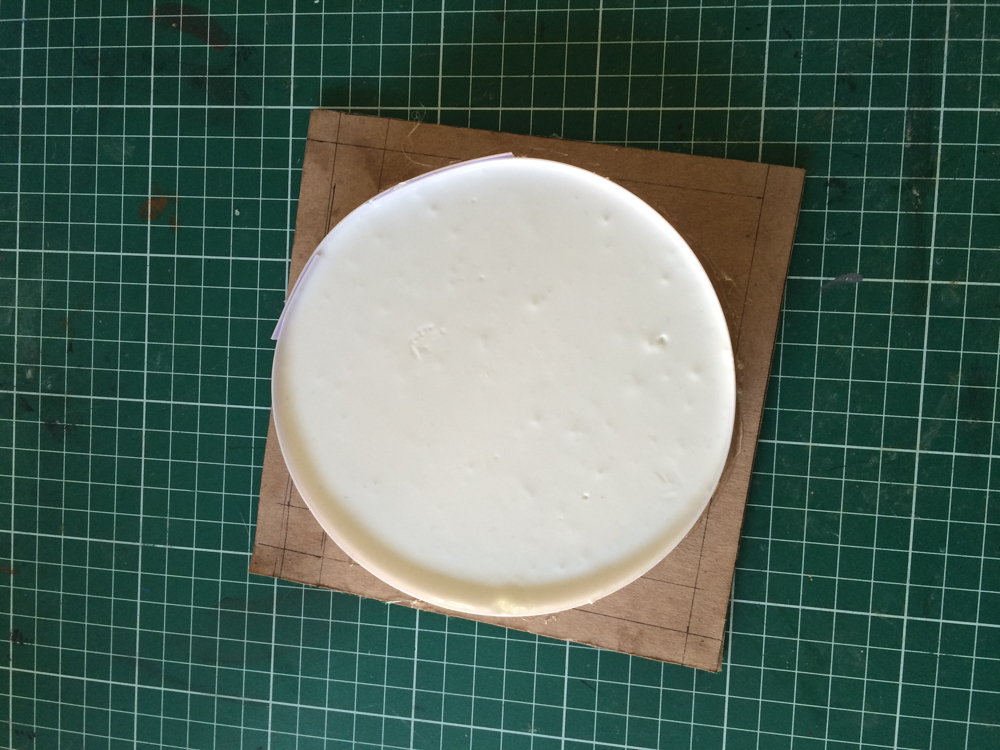

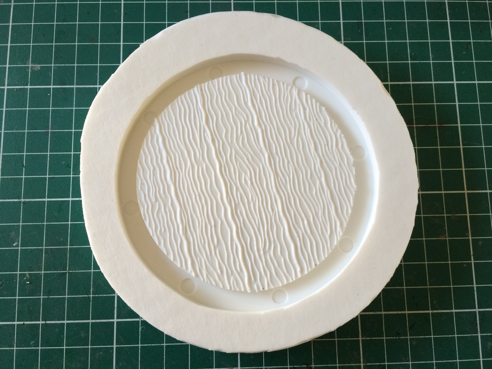

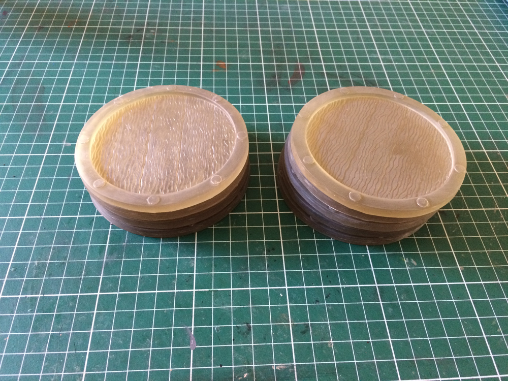

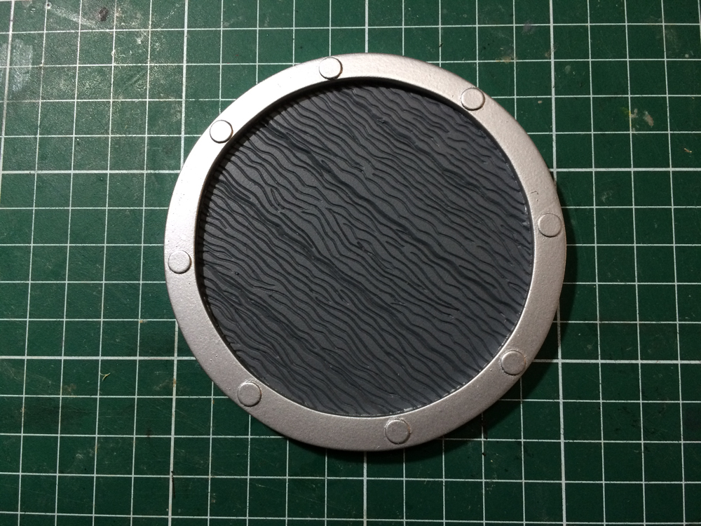

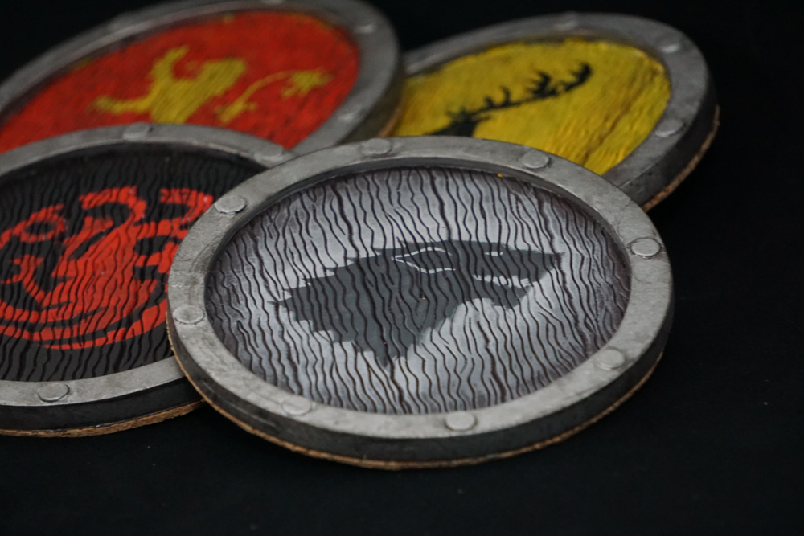

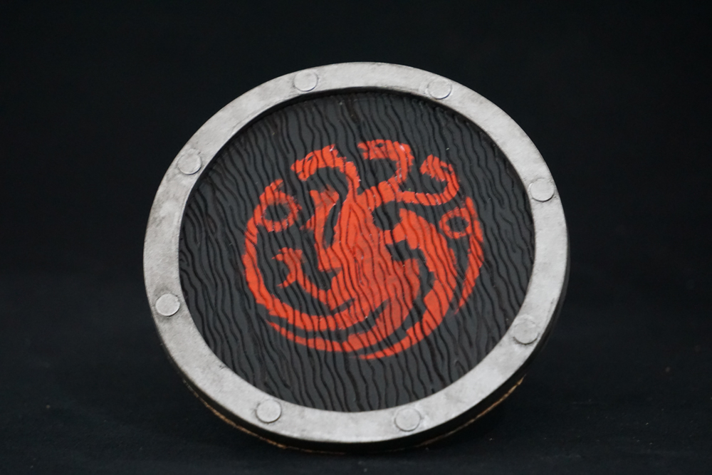

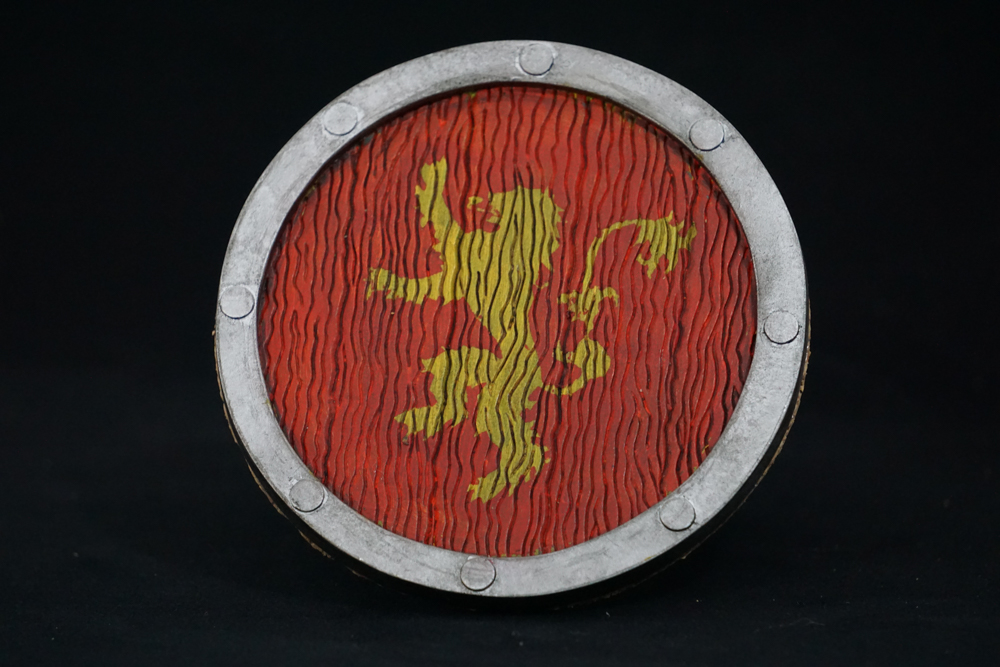

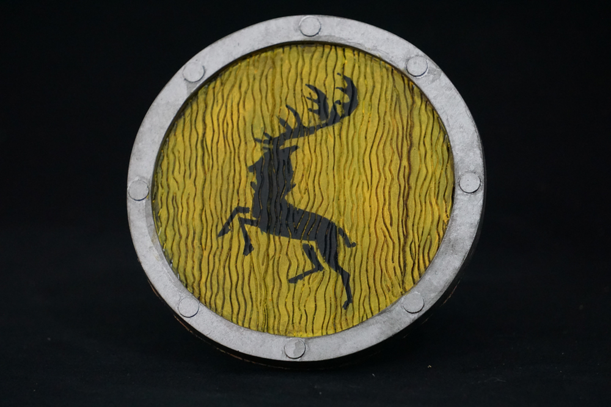