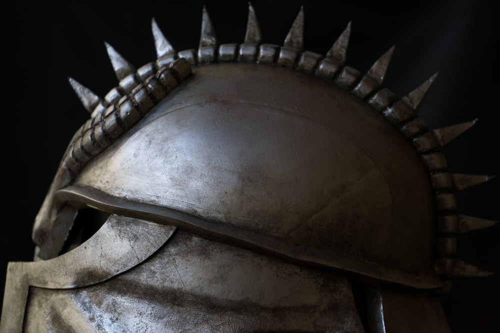
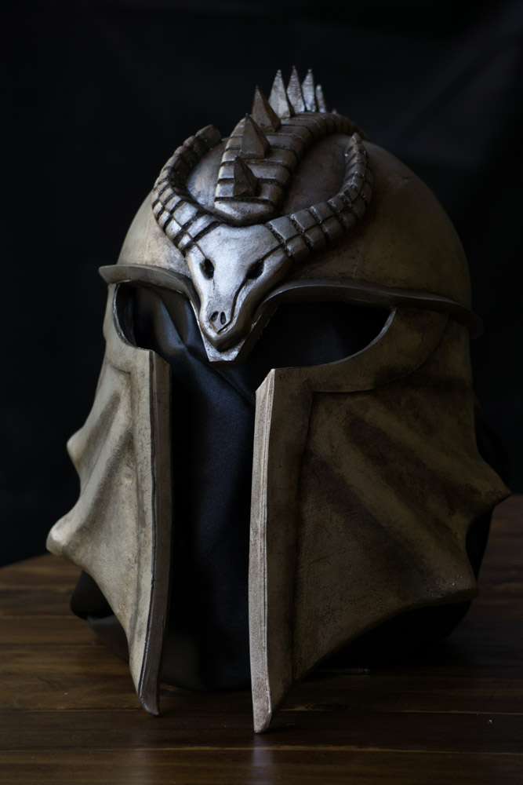
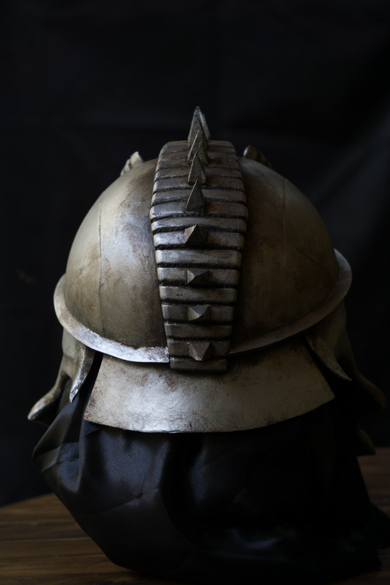
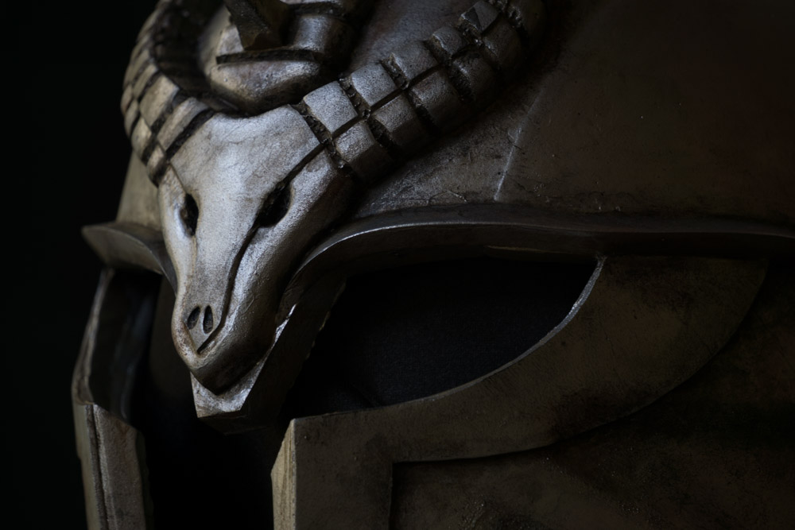
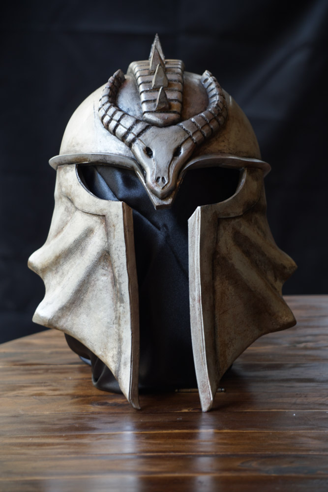
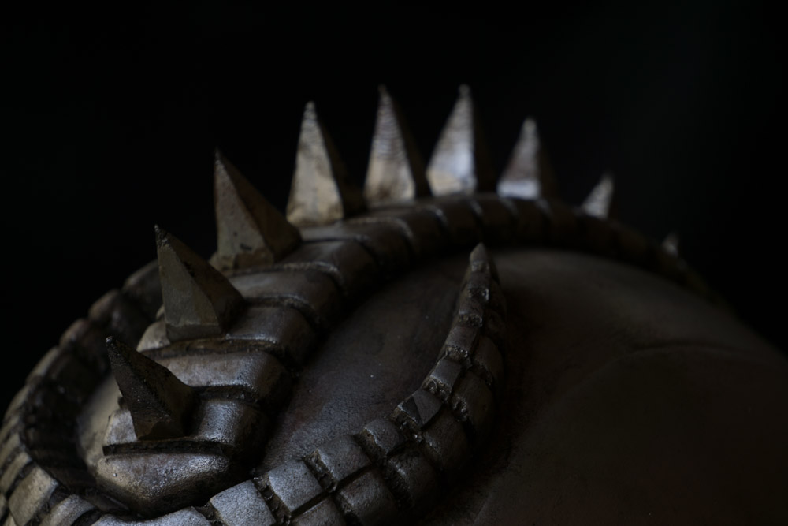
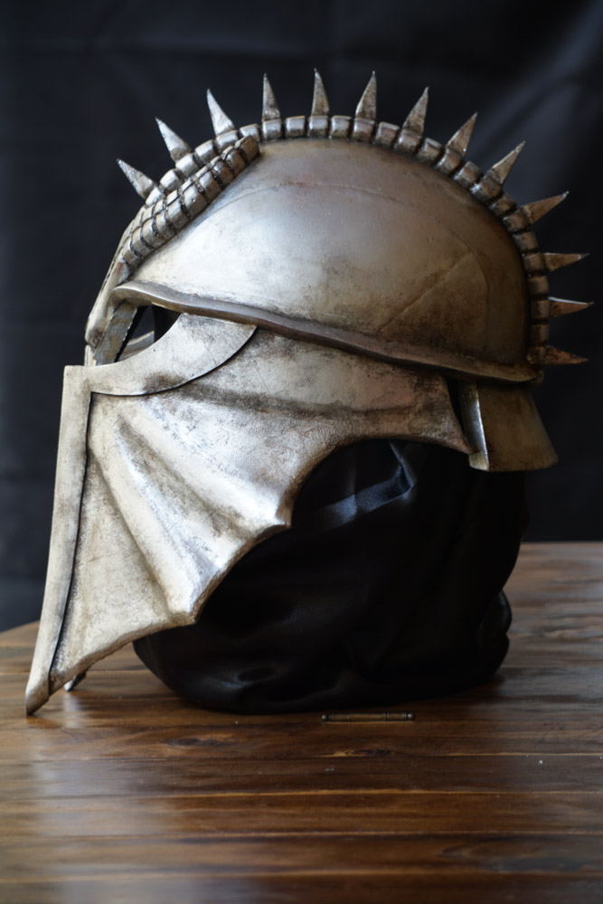
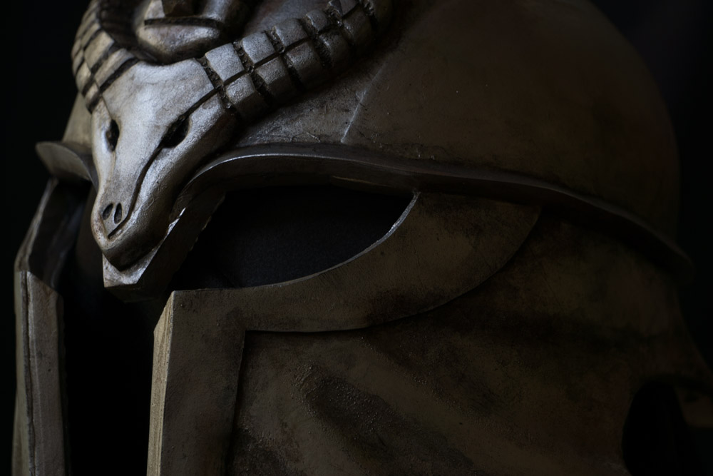

This is one of my first builds made with EVA foam, I followed [Evil Ted’s video](https://www.youtube.com/watch?v=RHyGcJaumHM) tutorial, and got the template for free also from his site [here](http://eviltedsmith.com/product/inquisitor-helmet-pattern/).

