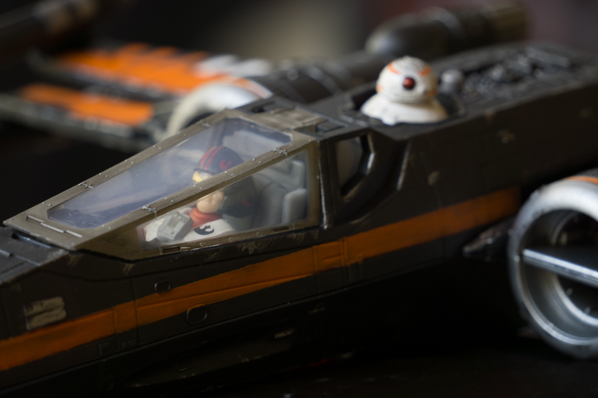
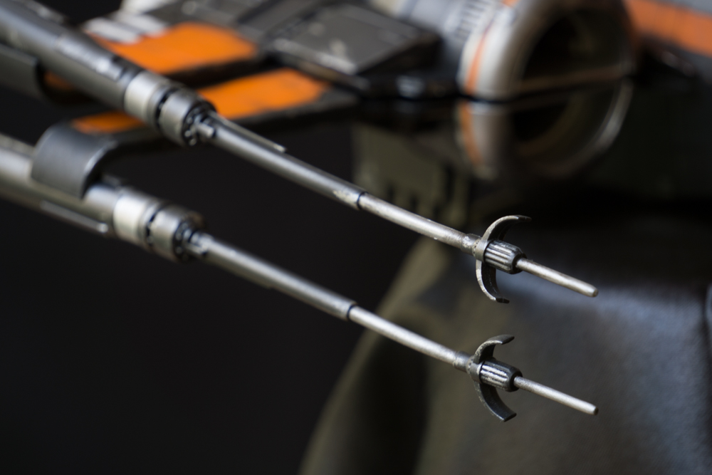
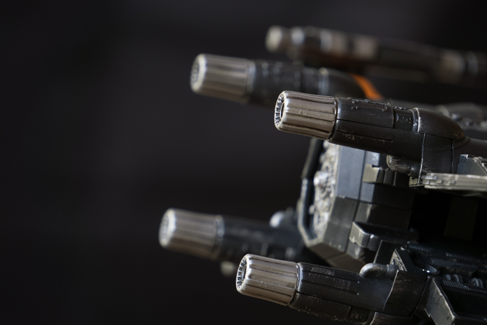
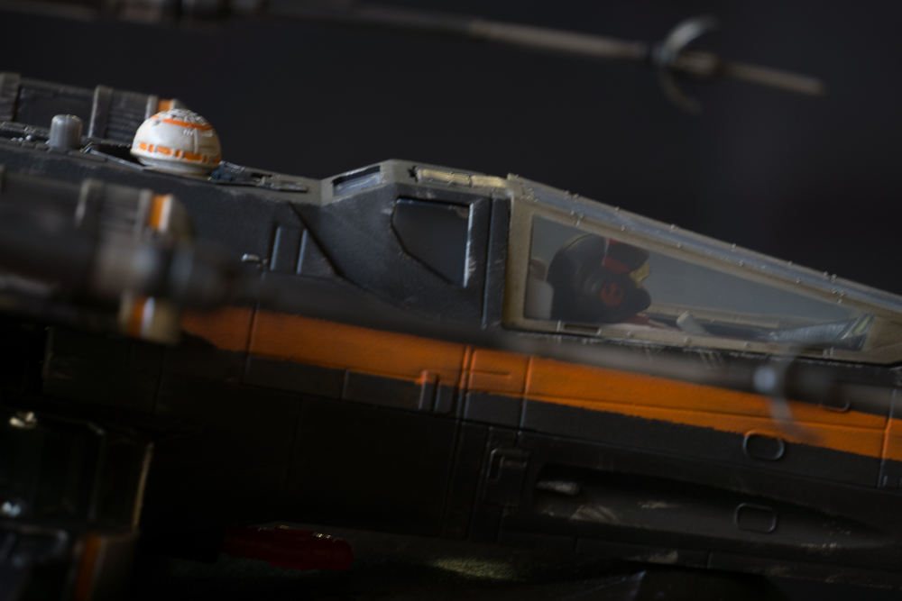
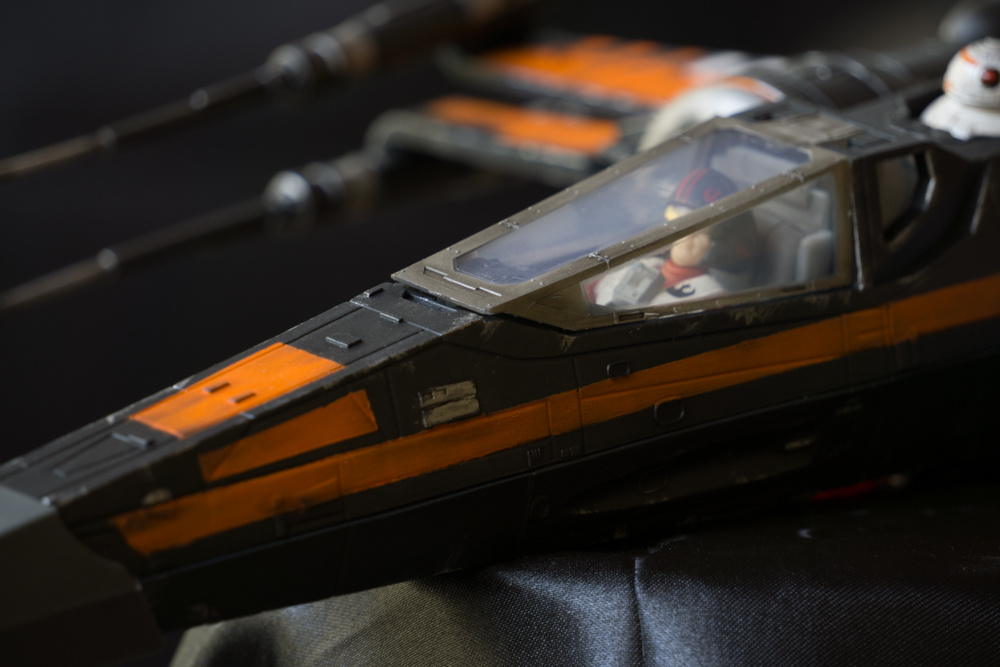
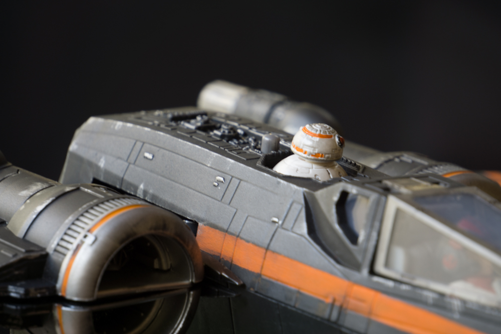
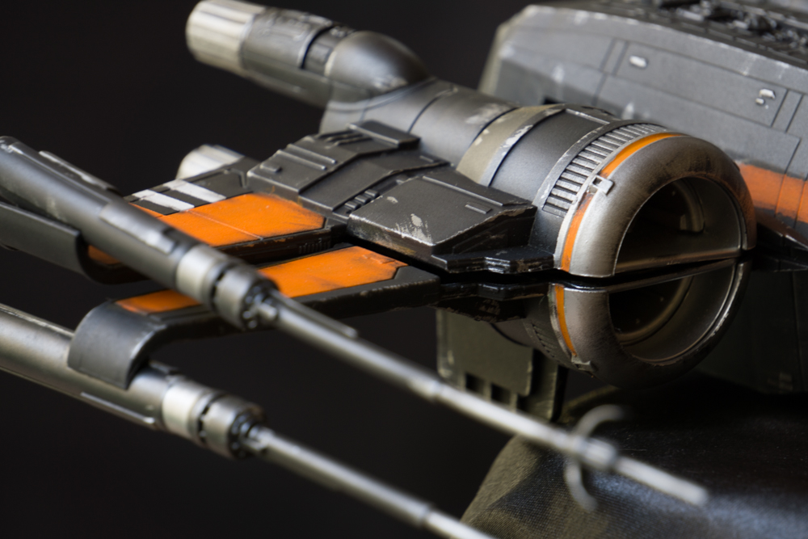
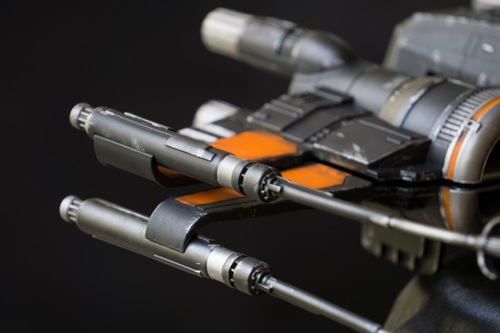
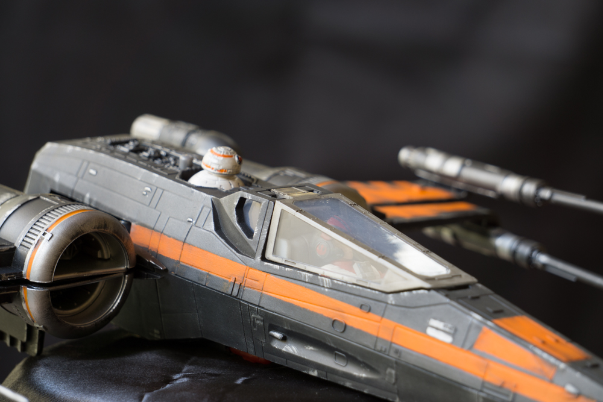
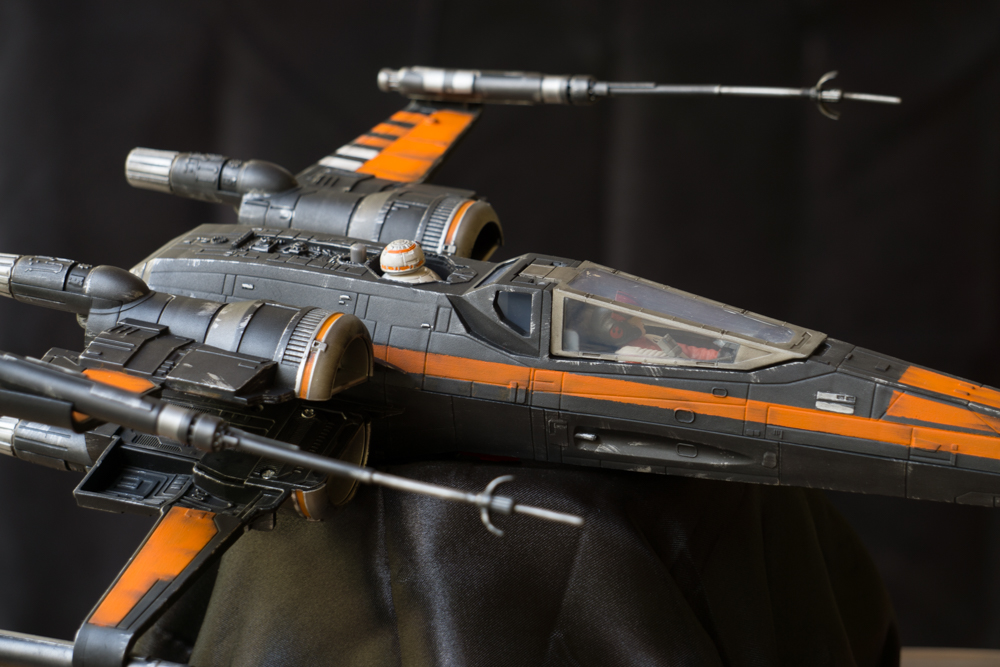

Got the new Poe Dameron’s Black X-Wing but when I opened it surprise! it is not black lol, so I have to give this guy a new paint job.
I first turned everything apart so that It’s easier for me to paint.

*Note: Take a lot of pictures or a video while doing this so that when it is time to put it all together you know how to do it.

I painted it all black as a base, and then added color and some weathering with oil paints. 

