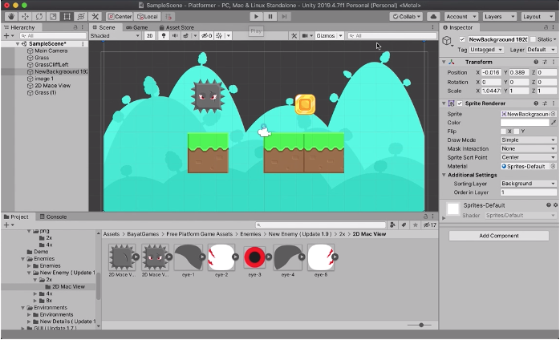

After many years of being a web and mobile developer I started feeling like I needed to do something different and not just on the programming side, also on the artistic side. Fortunately at work they give us the opportunity to work one day on something of our interest, so I wondered what if I dive into Game Dev but not just create a javascript mini web game but create something more complete.

I did some research and found about game engines, now what engine to use? I was between using Godot and Unity since these are the ones I found where recommended for beginners, so I chose Godot for being open source.

I installed Godot and started a tutorial on how to make a 2D platformer game, however since the very start I ran into UI problems. Godot is an open source game engine and it looks like it doesn’t work quite well on a mac, the font size was blown up, I reduced it to it’s smallest size on the settings panel but it still was too big. I continued like that anyways, but as I advanced through the tutorial and added more items, more tabs keep appearing and reducing the space on the UI, so it came to a point that I wasn’t able to see what I was doing or even to move around efficiently. I tried closing some of the tabs but seems that you can't.

After being very frustrated with Godot's UI I tried out Unity, that engine is not open source but looks more robust and it is free for individuals.

I worked with Unity and was able to create a simple demo, learned about colliders which are components that allow to tell if an object can react to others, also added physics to an object added gravity and created a small sprite looping animation. So far Unity has worked great and was easy to understand and apply this concepts.

On Game Dev itself this is the small part I’ve learned so far:

- The organization of elements is different, there is a new way of thinking and understanding the elements you add and how they interact with each other.

- Physics new thing to learn.

- On 2D games there are two options, tiles Based or Sprite Based graphics.

Let's see how deep this rabbit hole goes. 

