I made a pattern in illustrator, you can download the pattern for free here:  Trollhunters amulet blueprint.

Made the basic shape out of Sintra and for the details I mostly used two part epoxy putty to be able to sculpt detail runes all the way round. For the amulets base I created a two part mold, and the castings where roto-casted however this didn't work very well, since it was very dificult to keep a consistent thikness thougout all the piece, I actually ended up filling up the rim sides with epoxy putty after I casted the piece so that I could have a more solid piece to work on.

For the smaller parts I made a box mold, however casting parts in this is pretty difficult because they are so small, maybe next time I'll try injection molding. 

What I did for the center part is that I drew a pattern with illustrator based on some references to be able to replicate the graphics in the center part, then I laser engraved them in a 1.5mm acrylic. The acrylic still had a protective sheet color blue wich I ended up leaving.

This is my first attempt on wiring something, It took me about an hour to put this together but I finally got it, what I learned on this is to make sure that your electronics are going to fit into your prop before actually commiting to make molds and casts, on mine was a very tight fit and it kinda works but for the next time I think I'm going to figure out the electronics first.

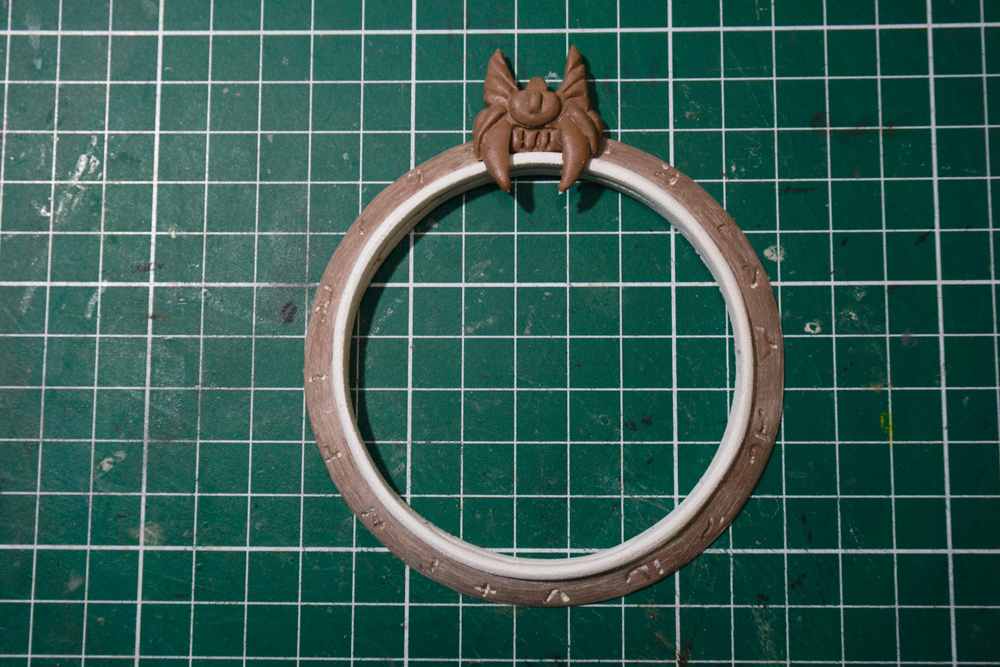

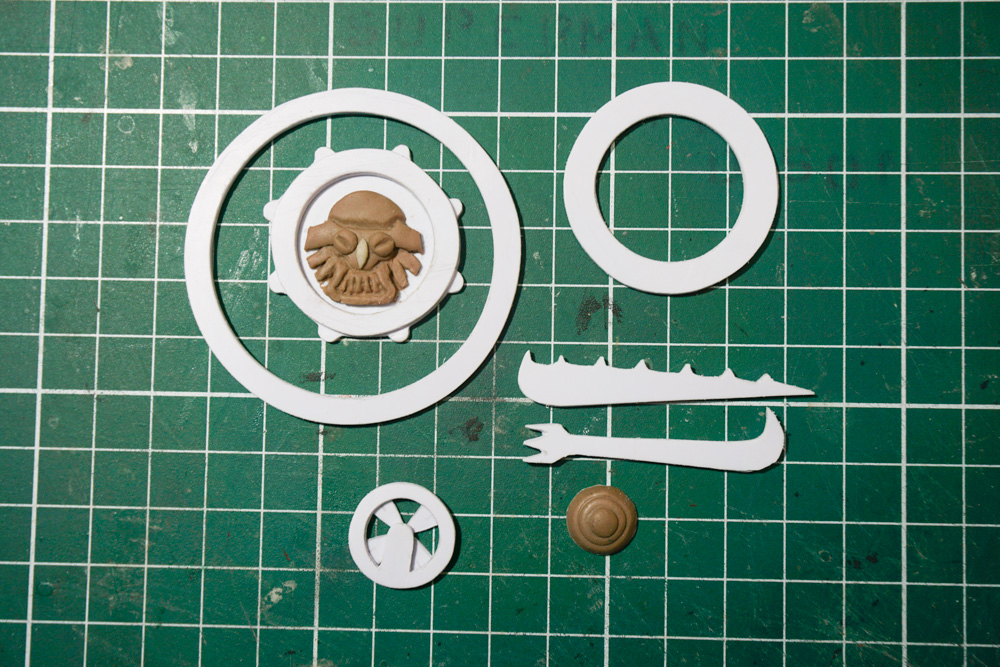

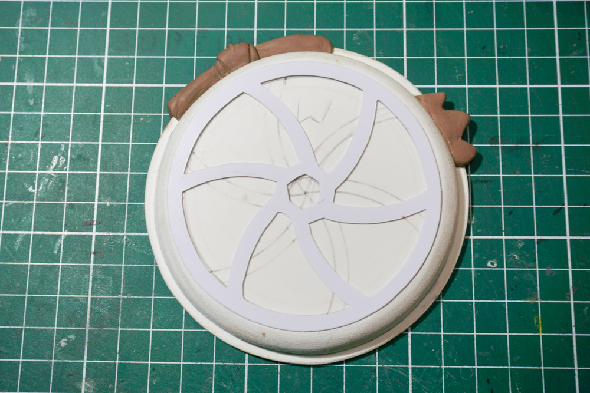

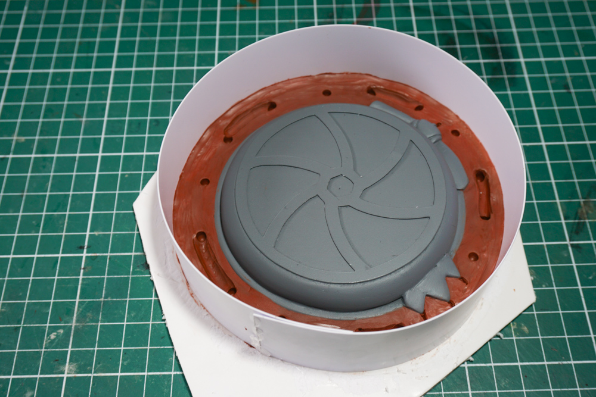

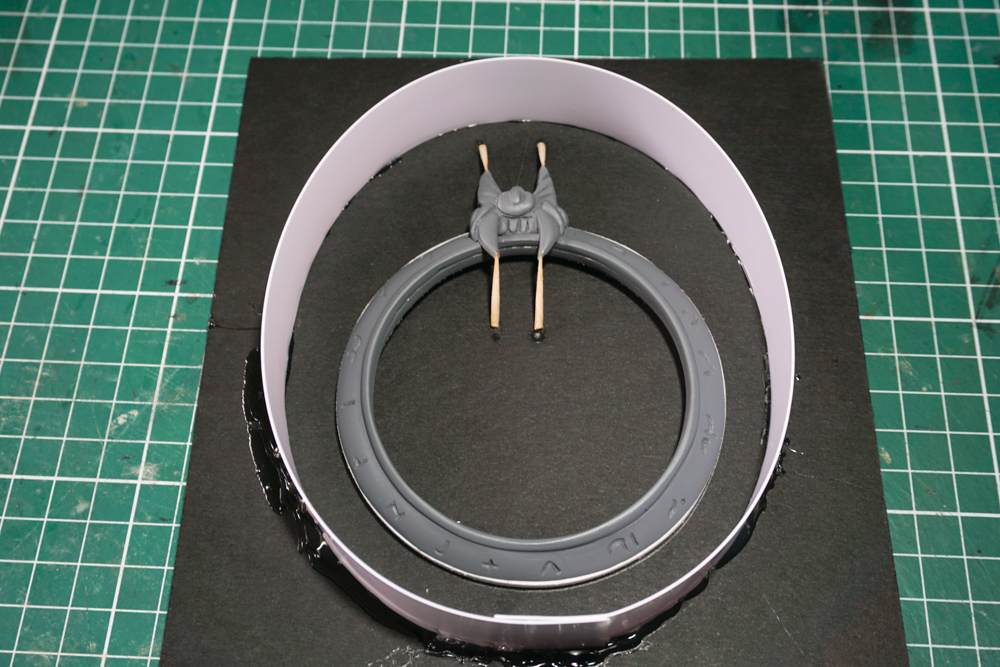

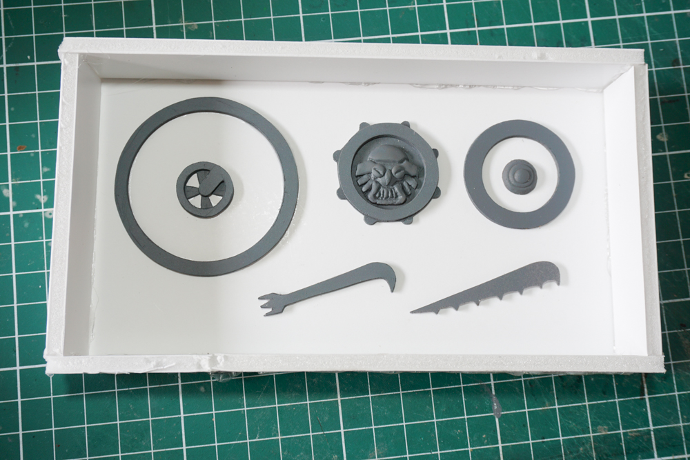

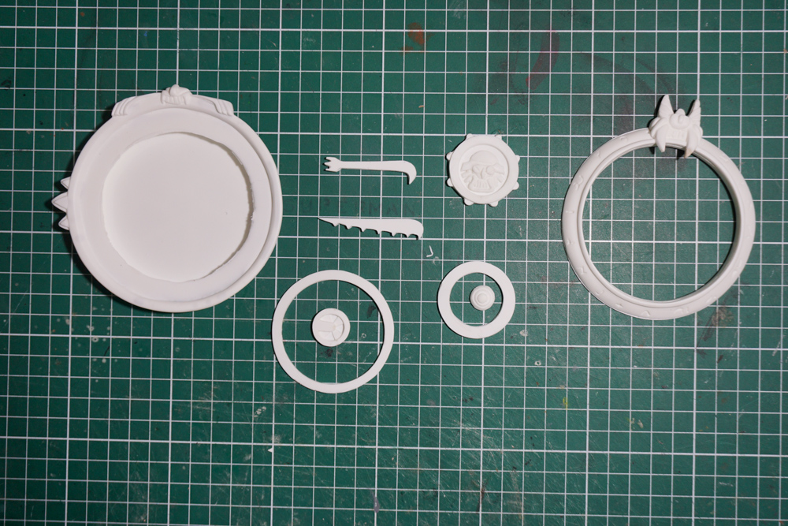

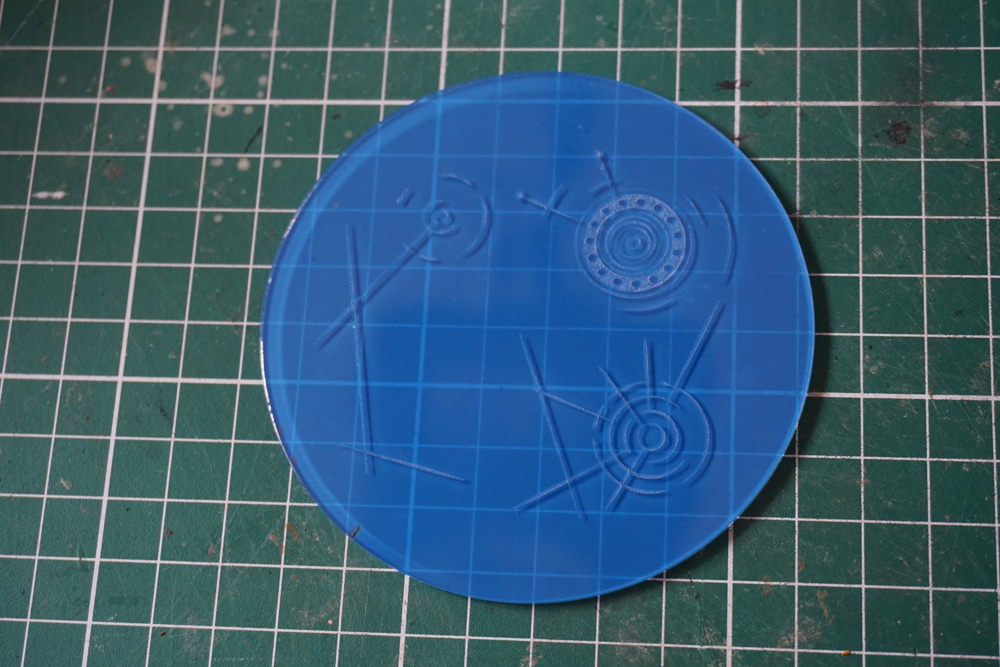

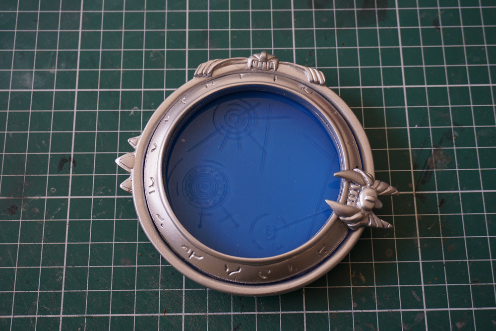

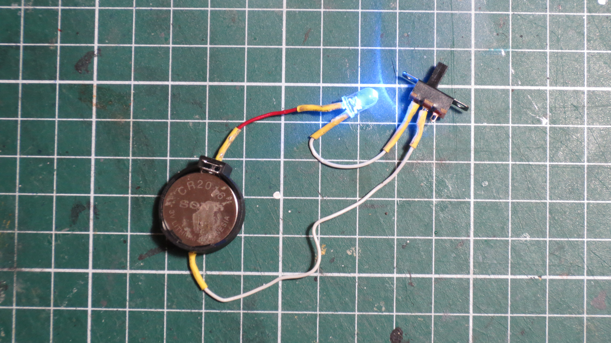

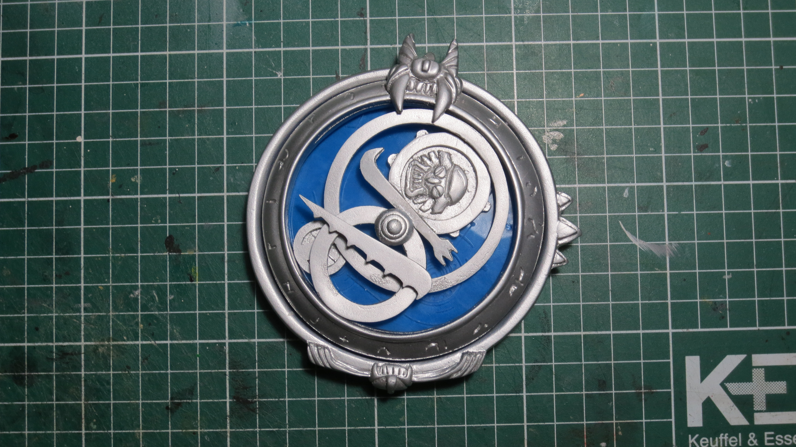